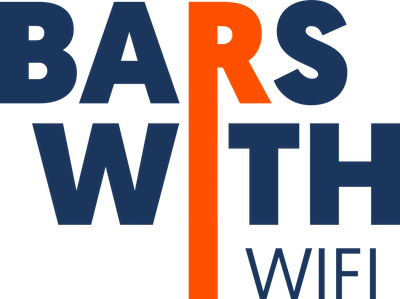

<h1 align="center">
  
</h1>

## About

Are you someone who enjoys sitting in bars where the WiFi runs free but hate finding out your new favorite watering hole has zero accessible power outlets? You could also be someone searching for the best place to host your book club or study group that has options (and comfortable seating) for everyone.

With Bars With WiFi, you won't find contradicting opinions or "elites" making harsh judgment calls about a perfectly pleasant brewpub or tea shop. Instead, BWW will help you find bars by WiFi quality, best places to sit inside a venue to work, and how friendly the bar staff are to staring at the backside of a laptop or tablet.

**Sign up below for updates on the official release date slated for sometime summer 2018. If you're interested in being one of the first beta users, also indicate that below and we'll contact when beta registration is open.**

[Click me!](https://mailchi.mp/69cb1cbc4d74/bars-with-wifi-coming-summer-2018-sign-up)

## Technologies Used

* Rails 5.1.5
* ReactJS
* Postgresql

## Installation
(Coming Soon)

## Contributing Guidelines
(Coming Soon)

## Release Notes
(Coming Soon)
